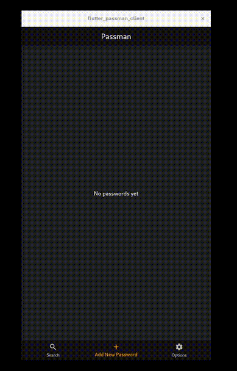

# Passman Flutter Client

*A standalone Flutter client for [`leonardo-luz/rust-passman-cli`](https://github.com/leonardo-luz/rust-passman-cli)*



## Requirements

* Flutter
* SQLite

## Features

* **Backup export/import** fully compatible with `rust-passman-cli`
* **Secure password storage**: passwords are encrypted with a strong algorithm and protected by a master password
* **Strong password generation**
* **Import passwords from files**

## Installation & Running

```bash

    # Clone the repository
    git clone https://github.com/leonardo-luz/passman-flutter-client.git
    cd passman-flutter-client

    # Run the app
    flutter pub get
    flutter run

```

## Contributing

Contributions are welcome! Feel free to open an issue or submit a pull request.

## License

This project is licensed under the [MIT License](./LICENSE.md).
